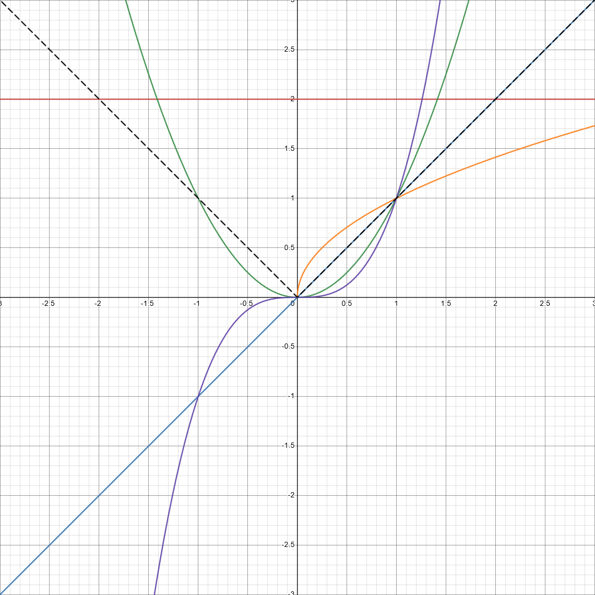
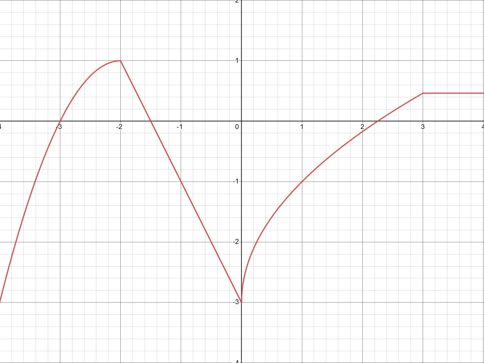

# 1.2 Exponents and Radicals

`Properties of Exponents`
> - **Product Rule**: $a^ma^n = a^{m + n}$
> - **Power of a Power**: $(a^m)^n = a^{mn}$
> - **Power of a Product**: $(ab)^n = a^nb^n$
> - **Quotient Rule**: $\frac{a^m}{a^n} = a^{m-n}$
> - **Power of a Quotient**: $\left(\frac{a}{b}\right)^n = \frac{a^n}{b^n}$
> - **Negative Power**: $a^{-n} = \frac{1}{a^n}, a \ne 0$
> - **Zero Exponent Rule**: $a^0 = 1, a \ne 0$

`Properties of Radicals`
> - **Fractional Exponents**: $\sqrt[n]{a} = a^{\frac{1}{n}}$
> - **Power of a Radical**: $(\sqrt[n]{a})^m = \sqrt[n]{a^m} = a^{\frac{m}{n}}$
> - **Product Rule**: $\sqrt[n]{ab} = \sqrt[n]{a}\sqrt[n]{b}$
> - **Quotient Rule**: $\sqrt[n]{\frac{a}{b}} = \frac{\sqrt[n]{a}}{\sqrt[n]{b}}$

# 1.3 Algebraic Expressions

`Algebraic Expressions and Polynomials`
> - **Variable**: A letter that can represent any number from a given set of numbers.
> - **Algebraic Expression**: A conglomerate of variables and real numbers.
> - **Polynomial**: An algrebraic expression in the form $a_nx^n + a_{n-1}x^{n-1} + ... + a_1x_1 + a_0$, where $a_0, a_1, ..., a_n$ are real numbers, and $n$ is a non-negative integer.
> - **Monomial**: A polynomial with a single term $a_kx^k$.
> - **Term / Monomial**: Each monomial $a_kx^k$ in a polynomial is a term.
> - **Degree**: Highest power of the polynomial.
> - **Binomial**: A polynomial with 2 terms.
> - **Trinomial**: A polynomial with 3 terms.

`Product / Factoring Formulas`
> - **Difference of Squares**: $a^2 - b^2 = (a + b)(a - b)$
> - **Difference of Cubes**: $a^3 - b^3 = (a - b)(a^2 - ab + b^2)$
> - **Sum of Cubes**: $a^3 - b^3 = (a + b)(a^2 - ab + b^2)$
> - **Square of a Sum**: $(a + b)^2 = a^2 + 2ab + b^2$
> - **Square of a Difference**: $(a + b)^2 = a^2 + 2ab + b^2$
> - **Cube of a Sum**: $(a + b)^3 = a^3 + 3a^2b + 3ab^2 + b^3$
> - **Cube of a Difference**: $(a + b)^3 = a^3 - 3a^2b + 3ab^2 - b^3$

# 1.4 Rational Expressions

`Vocabulary`
> - **Fractional Expression**: The quotient of two algebraic expressions.
> - **Rational Expression**: A fractional expression whose numerator and denominator are polynomials.
> - **Domain**: The set of all real numbers that a given variable is allowed to have.

# 1.5 Equations

`Solving Quadratics`
> - **Quadratic Form**: $ax^2+bx+c$
> - **Factoring a Quadratic**:
>     - When $a=1$, find two numbers that, when multiplied, match $c$, and whose sum matches $b$. For example:
>         1. $x^2+9x-10=0$
>         1. $-1 \cdot 10 = -10 = c; -1 + 10 = 9 = b$
>         1. $(x-1)(x+10)=0$
>     - If $a \ne 1$, find two numbers that, when multiplied, match $a \cdot c$, and whose sum matches $b$. For example:
>         1. $4x^2+8x-5=0$
>         1. $-2 \cdot 10 = -20 = a \cdot c; -2 + 10 = 8 = b$
>         1. $(4x^2-2x) + (10x-5) = 0$
>         1. $2x(2x-1) + 5(2x-1) = 0$
>         1. $(2x-1)(2x+5)=0$
>     - You can also use the Quadratic Formula, which is $x=\frac{-b \pm \sqrt[2]{b^2-4ac}}{2a}$
>     - Finally, you can solve by **completing the square**. To do so, move the constant to the right side, then add $\left(\frac{b}{2}\right)^2$ to both sides and solve like normal. You can also use this formula for simplicity: $a\left(x + \frac{b}{2a}\right)^2 = -c + \frac{b^2}{4a}$ which was derived as follows:
>   > 1. $ax^2 + bx + c = 0$
>   > 1. $ax^2 + bx = 0 - c$
>   > 1. $a\left(x^2 + \frac{b}{a}x\right) = -c$
>   > 1. $a\left(x^2 + \frac{b}{a}x\right) + \left(\frac{b}{2a}\right)^2 = -c + \left(\frac{b}{2a}\right)^2$
>   > 1. $a\left(x^2 + \frac{b}{a}x\right) + \left(\frac{b}{2a}\right)^2 = -c + \frac{b^2}{4a^2}$
>   > 1. $a\left(x^2 + \frac{b}{a}x + \left(\frac{b}{2a}\right)^2\right) = -c + \frac{b^2}{4a^2} \cdot a$
>   > 1. $a\left(x + \frac{b}{2a}\right)^2 = -c + \frac{b^2}{4a}$

# 1.6 Complex numbers

`Review`
> - $i$ is defined as $\sqrt{-1}$.
> - $i^2=-1; i^3=-i; i^4 = 1; i^n = i^{n\\; mod\\; 4}$ <!-- KaTeX uses \;, but GFM uses MathJax, which seems to require \\;. This may be a result of the markdown pre-parsing the unescaped backslash, although it seems to only effect single-character sequences. -->
> - The complex number system is the set of all numbers of the form $a+bi$ where $a$ and $b$ are real numbers.
> - Addition, subtraction, multiplcation, and division all follow the same rules as a binomial. Just keep in mind the rules of $i^n$.

# 1.8 Inequalities

`Inquality Notation`
> $x\circ n$ where $\circ$ is $\lt$, $\gt$, $\le$, or $\ge$.

`Set Builder Notation`
> $\left\\{x|...\right\\}$ where $...$ is some criteria. For example: $\left\\{x|x\lt 10\right\\}$, which is pronounced `the set of all numbers x such that x is less than 10`.

`Interval Notation`
> Interval notation uses brackets ($[]$) and parenthesis ($()$) to indicate a range of numbers. For example, $[3, \infty)$ would be all numbers greater than or equal to $3$. $\infty$ and $-\infty$ must end in parethesis. Intervals can be merged with other intervals or sets, for example: $(-\infty, -10)\cup \{0\}\cup [3, \infty)$ is all numbers less than $-10$, or exactly $0$, or all numbers greater than **or equal to** $3$.

`Nonlinear Inequalities`
> Nonlinear inequalities can be solved by using the Critical Value method:
> 1. Find the critical values of the inequality; that is, all real solutions of the inequality when the inequality sign is replaced with an equals, then solved, as well as any values in which the inequality is undefined.
> 1. Test all critical values, as well as a point in each interval. Once you know which values passed, you can build an interval solution to the inequality.

`Absolute Value Inequalities`
> Absolute value inequalities can be solved by following the below steps:
> 1. Isolate the absolute value.
> 1. If in the form $|u|\gt a$, then the solution is the union of the solutions to $u\lt -a$ and $u\gt a$.
> 1. If in the form $|u|\ge a$, then the solution is the union of the solutions to $u\le -a$ and $u\ge a$.
> 1. If in the form $|u|\lt a$, then the solution is the solution to $-a\lt u\lt a$.
> 1. If in the form $|u|\le a$, then the solution is the solution to $-a\le u\le a$.

# 1.9 The Coordinate Plane; Graphs of Equations; Circles

`Distance and Midpoint Formulas`
> - The distance between two 2-dimentional points $(x_1, y_1)$ and $(x_2, y_2)$ is $d=\sqrt{(x_2-x_1)^2+(y_2-y_1)^2}$
> - The midpoint between two 2-dimentional points $(x_1, y_1)$ and $(x_2, y_2)$ is $\left(\frac{x_1+x_2}{2}, \frac{y_1+y_2}{2}\right)$

`Symmetry`
> Given an **equation** $P(x)$ (not a function), the symmetry of the graph of $P(x)$ is:
> - Symmetric about the y-axis if $fP(x) = P(-x)$
> - Symmetric about the x-axis if $fP(x) = -P(x)$
> - Symmetric about the origin ($(0,0)$) if $fP(x) = -P(-x)$

`Circles`
> Vocabulary:
> - The fixed point in the middle of the circle is called the **center**.
> - The **circumference** is the outside of the circle, which contains all x-y solution pairs of the equation.
> - The **radius** is the distance between the center and any point along the circumference.
> - The **diameter** is the double the radius.
> - **Standard Form** of the equation of a circle: $(x-h)^2+(y-k)^2=r^2$ where $(h,k)$ is the center of the circle, and $r$ is the radius.
> - **General Form** of the equation of a circle: $Ax^2+Ay^2+Dx+Ey+F=0$
> - **General Form to Standard Form**: To transform a circle equation that is in general form into standard form, follow the below steps:
>   1. Move constant to right side.
>   1. Ensure that $A=1$.
>   1. Group up terms with same variables.
>   1. Factor each group by completing the square.

# 1.10 Lines

`General Formulas`
> - **Slope of a Line**: $m=\frac{\Delta y}{\Delta x}$
> - **Point-Slope Form of a Line**: $y-y_1=m(x-x_1)$ where $(x_1, y_1)$ is a point on that line, and $m$ is the slope of that line.
>    - **Point-Slope Form to Slope-Intercept Form**: $y=mx + (y_1-mx_1)$
> - **Slope-Intercept Form of a Line**: $y=mx+b$ where $m$ is the slope of that line and $b$ is its y-intercept.
> - **Standard Form of a Line**: $Ax+By=C$ where $A$, $B$, and $C$ are integers.
>    - **Point-Slope Form to Partial Standard Form**: $-mx + y=y_1 - mx_1$; multiply by whatever number will make all constants integers.

`Vertical Lines`
> - **Form**: $x=a$
> - **Slope**: Undefined.

`Horizontal Lines`
> - **Form**: $y=b$
> - **Slope**: $0$.

`Parallel and Perpendicular Lines`
> - If $l_1\parallel l_2$, then $m_1=m_2$
> - If $l_1\perp l_2$, then $m_1=-\frac{1}{m_2}$

# 2.1 Functions

A **function** is a rule that assigns to each element $x$ in a set $A$ extactly one element $f(x)$ in a set $B$. When pronouncing a function, for example $f(x)=2x+1$ would be pronounced `f of x equals two x plus 1`. The domain of $f(x)$, also known as the *independent variables*, is written as $D_f$, and is the set of all permissible values for $x$. The range of $f(x)$, also known as the *dependent variables*, is written as $R_f$, and is the set of all possible values of $f(x)$.

`Piecewise Functions`
> In the example piecewise function below:
>
> $$
> f(x) =
> \begin{cases}
>     3x & x \lt 0 \\
>     x+1 & 0 \le x \le 2 \\
>     (x-2)^2 & x \gt 2
> \end{cases}
> $$
>
> We use $3x$ *if and only if* $x$ is less than $0$. If $x$ is between $0$ and $2$, then we use $x+1$. If $x$ is greater than $2$, we use $(x-2)^2$

`Difference Quotient`
> Defined as $\frac{f(x+h)-f(x)}{h}$ where $h$ is left as a variable.

# 2.2 Graphs of Functions

`Parent Functions`
> Below are some parent functions and their graphs:
> - **RED**: $f(x)=c$ (in this case $c=2$), the constant function.
> - **BLUE**: $f(x)=x$, the identity function.
> - **GREEN**: $f(x)=x^2$, the squaring function.
> - **ORANGE**: $f(x)=\sqrt{x}$, the square root function.
> - **PURPLE**: $f(x)=x^3$, the cubing function.
> - **BLACK**: $f(x)=|x|$, the absolute value function.
> 

`Vertical Line Test`
> In order to ensure a given graph represents a function, you can perform the **vertical line test**. If a vertical line placed at any point on the coordinate plane intercepts the graph in two locations, **it is not a function**.

# 2.3 Getting Information from the Graph of a Function

`Increasing and Decreasing Functions`
> A function is **increasing** at all x-values where the corresponding y-values are increasing (from left to right). Similarly, a function is **decreasing** at all x-values where the corresponding y-values are decreasing. A function is **constant** at all x-values where the corresponding y-values remain the same. Points of transition **are not included**. For example, in the function displayed below, the function is *increasing* in the interval $(-\infty, -2)\cup (0, 3)$, *decreasing* in the interval $(-2, 0)$, and is *constant* in the interval $(3, \infty)$.
> 

# 2.4 Average Rate of Change of a Function

`Average Rate of Change Formula`
> The **average rate of change** of a function $f(x)$ between $x=a$ and $x=b$ is defined as $\frac{\Delta y}{\Delta x}$, or $\frac{f(b)-f(a)}{b-a}$.

# 2.5 Linear Functions and Models
> Any function in the form $f(x)=mx+b$ is called a **linear function**.

`Properties of the Slope of a Linear Function`
> 1. If $m\gt 0$, the line is **increasing**.
> 1. If $m\lt 0$, the line is **decreasing**.
> 1. If $m=0$, the line is **horizontal/constant**.
> 1. If $m$ is undefined, the line is **vertical**.

`Linear Models`
> When a linear function is used to model the relationship between two quantities, the **slope** of the graph of the function is the **rate of change** of one quantity in relation to another.

# 2.6 Transformations of Functions

> Any transformation made to the *outside* of the function (e.g. $f(x)+2) will modify the *outside* of the parent function, e.g. $x^2+2$. Any transformation made to the *inside* of the function (e.g. $f(2x)$) will modify the *inside* of the parent function, e.g. $(2x)^2$.

`Vertical Shifts`
> - $f(x)+n_0$: the graph is shifted *upwards* by $n_0$ units.
> - $f(x)-n_0$: the graph is shifted *downwards* by $n_0$ units.

`Horizontal Shifts`
> - $f(x+n_0)$: the graph is shifted *left* by $n_0$ units.
> - $f(x-n_0)$: the graph is shifted *right* by $n_0$ units.

`Reflecting`
> -$-f(x)$: the graph is reflected *about the x-axis*.
> -$f(-x)$: the graph is reflected *about the y-axis*.

`Vertical Compressions and Stretches`
> $n_0f(x),n_0\gt 1$: the graph will be stretched vertically (causing it to visually narrow).
> $n_0f(x),0\lt n_0\lt 1$: the graph will be compressed vertically (causing it to visually widen).

`Horizontal Compressions and Stretches`
> $f(n_0x),n_0\gt 1$: the graph will be compressed horizontally (causing it to visually narrow).
> $f(n_0x),0\lt n_0\lt 1$: the graph will be stretched horizontally (causing it to visually widen).

`Graphing Multiple Transformations`
> When graphing multiple transformations, order matters. Work form the **inside out**, starting with transformations closest to $x$, and working your way outward.

`Even and Odd Functions`
> A function $f$ is **even** if, for every number $x$ in its domain, the number $-x$ is also in the domain AND $f(x)=f(-x)$ (mirrored about the y-axis).
> A function $f$ is **even** if, for every number $x$ in its domain, the number $-x$ is also in the domain AND $f(-x)=-f(x)$ (mirrored about the origin).

# 3.1 Quadratic Functions and Models

`Quadratic Functions`
> - **Form**: $f(x) = ax^2 + bx + c$
> - **Standard Form**: $f(x) = a(x - h)^2 + k$
>     - Forms a parabola.
>     - **Vertex**: $(h, k)$
>     - **Symmetry**: About $x = h$
>     - **Y-Intercept**: At $a \cdot c$
>     - **Opens**: `UP` if $a \gt 0$, `DOWN` if $a \lt 0$
>     - **X-Intercepts**: Solutions of $ax^2 + bx + c = 0$
>     - **Maximum / Minimum Value**: Maximum (if $a \lt 0$) or minimum (if $a \gt 0$) is $k$

# 3.2 Polynomial Functions and Their Graphs

`End Behavior`
> If the degree of the polynomial is `ODD`:
> - If $a_n \gt 0$($\downarrow \uparrow$):
>     - As $x \rightarrow -\infty, y \rightarrow -\infty$
>     - As $x \rightarrow \infty, y \rightarrow \infty$
> - If $a_n \lt 0$($\uparrow \downarrow$):
>     - As $x \rightarrow -\infty, y \rightarrow \infty$
>     - As $x \rightarrow \infty, y \rightarrow -\infty$
> If the degree of the polynomial is `EVEN`:
> - If $a_n \gt 0$($\uparrow \uparrow$):
>     - As $x \rightarrow -\infty, y \rightarrow \infty$
>     - As $x \rightarrow \infty, y \rightarrow \infty$
> - If $a_n \lt 0$($\downarrow \downarrow$):
>     - As $x \rightarrow -\infty, y \rightarrow -\infty$
>     - As $x \rightarrow \infty, y \rightarrow -\infty$

`Real Zeros of Polynomials`
> Given a polynomial $P(x)$, if $P(c) = 0$, then $(x - c)$ is a factor of $P(x)$

`Intermediate Value Theorem for Polynomials`
> Suppose $P(x)$ is a polynomial function and $P(a)$ and $P(b)$ have opposite signs, then there exists at least one value $c$ between $a$ and $b$ where $P(c) = 0$.

# 3.6 Rational Functions

> Given a rational function $f(x) = \frac{P(x)}{Q(x)}$, where $P$ and $Q$ are polynomials and we assume that $P$ and $Q$ have no common factors:
> - The domain is all numbers where $Q \ne 0$

`Graphing Rational Functions`
> 1. **Factor**: Factor the numerator and denominator.
> 2. **Intercepts**:
>     1. **X-Intercept(s)**: Find the X-intercept(s) by finding the zeros of the numerator.
>     2. **Y-Intercept**: Find the Y-intercept by setting $x = 0$.
> 3. **Holes**: Any factor $(x - r)$ that is cancelled from the numerator and denominator will have a hole at $x = r$.
> 4. **Vertical Asymptotes**: Set the denominator equal to$0$and solve. Each solution $s$ will have a vertical asymptote at $x = s$. Test values on each side of the asymptote to determine the graph's behavior.
> 5. **Horizontal or Slant Asmyptotes**
>     1. If the degree of the numerator is less than the degree of the denominator, there is a horizontal asymptote at $y = 0$.
>     2. If the degree of the numerator is equal to the degree of the denominator, there is a horizontal asymptote at $y = \frac{a}{b}$ where $a$ is the leading coefficient of the highest term in the numerator, and $b$ is the leading coefficient of the highest term in the denominator.
>     3. If the degree of the numerator is exactly one more than the degree of the denominator, there is a slant asymptote $ax + b$ where $ax + b$ is the quotient (remainder is dropped) of the numerator divided by the denominator.

# 3.7 Polynomial and Rational Inequalities

`Solving Polynomial Inequalities`
> Move all variables to one side of the inequality, then find the zeros of the polynomial side. Test values between/around each zero and determine whether or not they satisfy the inequality.

`Rational Inequalities`
> Move all variables to one side of the inequality, then find the zeros and all values that make the rational polynomial undefined (i.e. when denominator = 0), and finally test values between/around each of the aforementioned and determine whether or not they satisfy the inequality.

# 4.1 Exponential Functions

> An exponential function is a function of the form $f(x)=a^x, a \gt 0, a \ne 1$ where $a$ is called the **base** of the function.

`Properties of The Exponential Parent Function`
> The parent function for exponential functions is$f(x)=a^x$, which has the following properties:
> - **Domain**: All real numbers.
> - **Range**: $(0, \infty)$
> - **Y-Intercept**: $(0, 1)$
> - **X-Intercept**: None.
> - $y=0$ is a **Horizontal Asymptote**.
> - If $a \gt 1$, then the function is increasing.
> - If $0 \lt a \lt 1$, then the function is decreasing.
> - $f(x)$ is a one-to-one function.

`Graphing the Parent Function`
> To graph the parent function, plot the points $\left(-1, \frac{1}{a}\right)$, $(0, 1)$, and $(1, a)$.

`Intermittent Compound Interest Function`
> $A(t) = P\left(1+ \frac{r}{n}\right)^{nt}$ where $A(t)$ is the ending value, $P$ is the principle, $r$ is the annual rate, $n$ is the interest period, and $t$ is the time in years.

# 4.2 The Natural Exponential Function

> $e$, or Euler's number, is approximately $2.718281828$.

`Continuous Compound Interest Function`
> $A(t)=Pe^{rt}$ where $A(t)$ is the ending value, $P$ is the principal, $r$ is the annual rate, and $t$ is the time in years.

`Exponential Growth Function`
> $Q(t)=q_0e^{kt}$ where $Q(t)$ is the ending population, $q_0$ is the initial population, $k$ is the growth rate (per period), and $t$ is the time (in periods).

`Exponential Decay Function`
> $Q(t)=q_0e^{-kt}$ where $Q(t)$ is the ending population, $q_0$ is the initial population, $k$ is the decay rate (per period), and $t$ is the time (in periods).

# 4.3 Logarithmic Functions

> The inverse of the exponential function $f(x)=a^x$ is $f^{-1}(x)=log_a(x)$.

> $f(x)=log_a(x), a \gt 0, a \ne 1$ is the parent function for logarithms.

`Properties of The Exponential Parent Function`
> The parent function for exponential functions is$f(x)=log_a(x)$, which has the following properties:
> - **Domain**: $(0, \infty)$
> - **Range**: All real numbers.
> - **Y-Intercept**: None.
> - **X-Intercept**: $(1, 0)$
> - $x=0$ is a **Vertical Asymptote**.
> - If $a \gt 1$, then the function is increasing.
> - If $0 \lt a \lt 1$, then the function is decreasing.
> - $f(x)$ is a one-to-one function.

`Graphing the Parent Function`
> To graph the parent function, plot the points $\left(\frac{1}{a}, -1\right)$, $(1, 0)$, and $(a, 1)$.

`Exponential Form to Logarithmic Form`
> The equation $a^n = b$ can be rewritten as $log_a(b) = n$. That is, $log_a(b)$ is the exponent of $a$ that produces $b$.

# 4.4 Laws of Largarithms

`Properties of Logarithms`
> - **Product Rule**: $log_a(xy)=log_a(x)+log_a(y)$
> - **Quotient Rule**: $log_a\left(\frac{x}{y}\right)=log_a(x)-log_a(y)$
> - **Power Rule**: $log_a(x^n)=n \cdot log_a(x)$
> - **Change of Base**: $log_a(x) = \frac{log_n(x)}{log_n(a)}$
> - **Other Properties**:
>     - $log_a(a^x) = x$
>     - $log_a\left(\frac{1}{a^n}\right) = -n$
>     - $log_a\left(\frac{1}{a}\right) = -1$
>     - $log_a(1) = 0$
>     - $log_a(a) = 1$
>     - $a^{log_a(x)} = x$

# 4.5 Exponential and Logarithmic Equations

`Solving Exponential Equations`
> 1. If the equation is in the form of $a^x=a^y$, it can be transformed into $x=y$, then solve.
> 2. If the equation is in the form of $a^x=c$, then change the form to $log_a(c) = x$, the solve.
> 3. If the equation is in the form of $a^{2x} \pm b^x + c$, then transform it into the quadratic form $A(u)^2+B(u)+C$ where $u$ is some common term, then solve for $u$. For example:
>    1. Solve for $x$, $e^{2x}-5e^x-14 = 0$
>    2. $(e^x)^2 - 5(e^x) - 14 = 0$
>    3. Solve the quadratic: $((e^x) - 7)((e^x) + 2) = 0$, thus $(e^x) = \{-2, 7\}$
>    4. Solve for $x$: $x = \{log_e(-2), log_e(7)\}$
>    5. Filter out complex or undefined answers (in this case, $log_e(-2)$).

# 4.6 Modeling with Exponential Functions

`Exponential Growth (doubling time)`
> $n(t)=n_02^{t/a}$ where $n(t)$ is the ending population, $n_0$ is the initial population, $t$ is the time (in periods), and $a$ is the doubling time (time in periods it takes for the population to double).

`Exponential Growth (relative growth rate)`
> $n(t)=n_0e^{rt}$ where $n(t)$ is the ending population, $n_0$ is the initial population, $t$ is the time (in periods), and $r$ is the relative growth rate.

`Radioactive Decay Model`
> $m(t)=m_0e^{-rt}$ where $m(t)$ is the ending mass, $m_0$ is the initial mass, $t$ is the time (in periods), and $r$ is the decay rate. $r$ is $ln(2) / h$ where $h$ is the half-life (in periods) of the substance.

# 4.7 Logarithmic Scales

`pH Scale`
> $pH=-log[H^+]$, where $H^+$ is the concentration of hydrogen ions measured in moles ($mol$) per liter ($L$). A $pH$ of $7$ is neutral, a $pH \lt 7$ is acidic, and a $pH \gt 7$ is basic.

`Richter Scale`
> $M=log(\frac{I}{S})$ where $M$ is the magnitute of the earthquake, $I$ is the intensity of the earthquake (measured by the amplitute of a seismograph reading taken 100km from the epicenter of the earthquake), and $S$ is $1 \mu$ or $10^{-4} cm$ (the "standard" amplitude of an earthquake).

`Decibel Scale`
> $B = 10log\left(\frac{I}{I_0}\right)$ where $B$ is the deicbel level ($dB$), $I$ is the intensity, and $I_0$ is $10^{-12} \frac{W}{m^2}$ (watts per square meter) at a frequency of $1000 Hz$ (hertz).

# 10.2 Systems of Linear Equations in Several Variables

`Solving Systems of Equations`
> 1. **Graphing**: a system of equations can be solved by graphing all equations, although this method is not incredibly accurate when done by hand.
> 2. **Elimination Method**: Take the following system of equations: $2x+y=5$ and $x-3y=-1$. To solve for $y$, we can multiple our second equation by $-2$, then combine the two equations, giving us $7y=7$, thus $y=1$. Then, you can plug that number into the first equation to get $x$.
> 3. **Gaussian Elimination**: The goal here is to write the system in triangular form, which then makes it incredibly easy to solve. We have three tools to help us do so:
>    1. You can interchange the position of any two equations.
>    2. You can multiply any equation by a nonzero constant.
>    3. You can add a nonzero multiple of one equation to another.
>    4. An equivalent equation $R_m$ can be created by adding $R_m$ to some other equation $R_n$ (in the same system) multiplied by a constant $c$.

# 10.7 Partial Fractions

`Partial Fraction Decomposition`
> To decompose a rational expression into a sum of multiple partial fractions, do the following:
> - **Case 1**: If the denominator is a product of distinct linear factors $(a_1x+b_1)(a_2x+b_2)...(a_nx+b_n)$, then the rational expression will take the form $\frac{A_1}{a_1x+b_1}+\frac{A_2}{a_2x+b_2}+...+\frac{A_n}{a_nx+b_n}$. To solve, do the following:
>    1. ...
> - **Case 2**: If the denominator a linear factor with a multiplicity greater than 1, then the rational expression will take the form $\frac{A_1}{ax+b} + \frac{A_2}{(ax+b)^2}+...+\frac{A_k}{(ax+b)^k}$
> - **Case 5**: If the denominator contains any prime factors (polynomials that cannot be factored further), then the rational expression will take the form $\frac{Bx+C}{x^2+bx+c}$; for the rest, use the previous cases.
